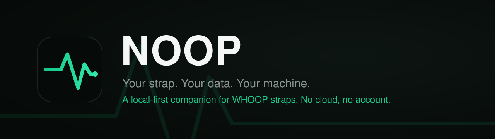

<p align="center">
  
</p>

<h1 align="center">NOOP</h1>

<p align="center"><b>Your strap. Your data. Your machine. Local-first, no cloud.</b></p>

<p align="center">
  
  
  
</p>


## Download

Latest release: **v1.8.8** — [View all releases](../../releases)

| Platform | Download | Run |
|----------|----------|-----|
| **Windows x64** | [NOOP-x64.7z](../../releases) | Run installer → launch `NOOP-x64.exe` |
| **Linux x64** | [NOOP-Linux-x64.run](../../releases) | `chmod +x` → run installer |
| **macOS Apple Silicon** | [NOOP-macOS-arm64.dmg](../../releases) | Open DMG → drag to Applications |

---

NOOP is a standalone, fully **offline** companion app for WHOOP straps (4.0 and
5.0). It pairs directly with the strap over Bluetooth, stores everything on your
own device in SQLite, imports your existing WHOOP and Apple Health history, and
computes recovery, strain, HRV, and sleep **locally**, with no WHOOP account and
no WHOOP cloud.

It is built on prior community reverse-engineering work and exists for one
reason: to let someone who owns a WHOOP strap read **their own biometric data**
from **their own device**, on a machine **they** control.

> **Not affiliated with WHOOP.** NOOP is an independent, unofficial
> interoperability project. It is not affiliated with, endorsed by, or connected
> to WHOOP, Inc. "WHOOP" is used only to identify the hardware NOOP talks to. Use
> it only with a device you own, and not in breach of any agreement that applies
> to you. **NOOP is not a medical device**; every derived metric is an

---

## Why NOOP

You bought the strap. The biometric stream it produces is yours. NOOP is built on
that premise:

- **Own your data.** NOOP reads heart rate, R-R intervals, SpO₂, skin temperature,
  respiration, accelerometer/gravity, battery, and event data straight off the
  strap over Bluetooth and writes it to a local SQLite database. Nothing is
  uploaded anywhere.
- **Account-free and local.** NOOP never logs into a WHOOP account and never hits
  a WHOOP server. It does not bypass any login, paywall, or DRM; it simply talks to
  a device you own and reads data you generated.
- **Bring your history.** Already have years of data in the official app or in
  Apple Health? Import the WHOOP CSV export and/or your Apple Health `export.xml`
  once, and it's permanently on your machine.
- **Transparent math.** Recovery, strain, HRV, and sleep are recomputed on-device
  from documented, citable methods (Task Force 1996 HRV, Karvonen %HRR, Edwards /
  Banister TRIMP, Tanaka HRmax, and so on). The algorithms are approximations of —
  not reproductions of — any proprietary model, and every analyzer file documents
  exactly what it does.

---

## Features

| Screen | What it does |
|---|---|
| **Today** (Control Center) | Home dashboard: recovery ring, a "today's synthesis" insight, a grid of stat tiles (recovery, strain, sleep, HRV, RHR, SpO₂, respiratory, steps, weight, calories) each with a 14-day sparkline, recent workouts, and a data-sources footer. |
| **Readiness** | An on-device "should you push today?" read that synthesizes established sports-science signals from your own history — HRV vs your baseline (Plews/Buchheit), resting-HR drift (Lamberts), sleeping respiratory-rate drift, training-load balance (acute:chronic workload ratio, Gabbett) and training monotony (Foster) — into a single headline (Primed / Balanced / Strained / Run down) with the drivers behind it. Pure local math, not medical advice. |
| **Live** | Real-time view of the connected strap — heart rate and frame stream as they arrive (~1 Hz). |
| **Breathe** | **HRV haptic breathing biofeedback.** The strap both *measures* HRV (R-R intervals) and *buzzes* its haptic motor, so NOOP paces your breath with felt cues (one buzz inhale, two exhale) and shows live HR + rolling RMSSD responding as the session deepens. Presets: Relax 4-6, Coherence 5.5, Box 4-4. |
| **Intervals** | **Silent haptic HIIT timer.** The strap buzzes every transition (triple-buzz into WORK, single into REST, 3-2-1 tick at phase ends, long buzz on finish) so you train hands-free. Falls back to a glanceable visual timer with no strap. |
| **Explore** (Metric Explorer) | Interrogate any single metric over time, built from the metric catalog (`Strand/Data/MetricCatalog.swift`). |
| **Compare** | Plot two metrics together / against each other over a shared timeline. |
| **Insights** | Behavioral and correlational insights derived from your own series. |
| **Sleep** | Sleep sessions with a hypnogram, stage breakdown, efficiency, resting HR, and HRV — computed by the on-device sleep stager. |
| **Trends** | Long-range trends across recovery, strain, sleep, and biometrics. |
| **Workouts** | Detected exercise sessions with strain and heart-rate detail. |
| **Health** | Biometric overview (HR, HRV, SpO₂, skin temperature, respiratory rate, etc.). |
| **Stress** | Day-level stress / autonomic load visualization. |
| **Apple Health** | Browse and reconcile data imported from your Apple Health export. |
| **Data Sources** | One-tap import of a WHOOP CSV export or an Apple Health export, plus live-strap status. "Bring your history in once, then it's yours." |
| **Notifications** | Configure local notifications and thresholds (`Strand/Data/NotificationSettingsStore.swift`). |
| **Automations** | Turn the strap's physical inputs and live biometrics into Mac actions — all on-device (see below). |
| **Coach** | An optional **AI Coach** you can ask about your data in plain language. It's the one feature that ever uses the network: off until you add your own OpenAI/Anthropic key, and it sends only a short text summary of recent metrics plus your question — never raw streams or identifiers. |
| **Settings** | Profile, preferences, the in-app **What's new** changelog, and an opt-in **Experimental** section (WHOOP 5/MG protocol probes). |
| **Support** | Attribution + **optional** crypto donations. The whole app works without them. |

---

### Strap support

NOOP is an independent, **experimental** project — capable, but a work in progress.

| Strap | Status |
|---|---|
| **WHOOP 4.0** | ✅ The tested, supported path. Live HR, recovery, strain, sleep, history offload — the full experience. |
| **WHOOP 5.0 / MG** | 🧪 **Live heart rate works** (confirmed on real hardware). Pick "WHOOP 5.0 / MG" before connecting — and see the pairing note below, because you can't just scan for it. Deeper 5/MG metrics (recovery, strain, sleep) are still being reverse-engineered; there's an opt-in **Settings → Experimental** toggle for 5/MG owners who want to help map the protocol. |

> ### Pairing a WHOOP 5.0 / MG — read this first
>
> A WHOOP strap holds an encrypted Bluetooth **bond with only one device at a time**, and yours is
> normally bonded to the **official WHOOP app** on your phone. **You can't just scan for it in NOOP** —
> if the strap is still bonded to the WHOOP app, NOOP's pairing is refused and the strap log shows
> *"Encryption is insufficient"* / *"bond refused."* (Live **heart rate** is the exception — it rides the
> standard Bluetooth heart-rate profile, so it streams without a bond. But pairing — needed for the
> deeper features — does not.)
>
> **To pair properly:**
> 1. **Close the official WHOOP app** on your phone (fully quit it, or turn that phone's Bluetooth off) so
>    it isn't holding the bond.
> 2. **Put the strap in pairing mode** — on a 5.0/MG, **tap the band repeatedly** (firm taps on the
>    sensor) until the **LEDs flash blue**.
> 3. In NOOP: **Live → choose "WHOOP 5.0 / MG" → Scan & Connect.** Success looks like
>    *"CLIENT_HELLO acked — link established"* in the strap log (not *"bond refused"*). It can take a
>    couple of attempts.
>
> **Only one device at a time.** Because the strap holds a single bond, don't leave it connected to your
> phone *and* your Mac (or the WHOOP app) at once — live heart rate will still show on all of them
> (that rides the bond-free standard profile), but **none** of them will have the real encrypted bond.
> If HR streams fine yet **buzz, alarm, double-tap and history don't work**, that's the tell: the strap
> isn't truly bonded to this device. Free it from everything else, then pair here.
>
> Bonding to NOOP may take the strap's bond away from the WHOOP app, so the official app might need to
> re-pair afterwards. This is the **hardest part of 5/MG support** — if it refuses, you're almost
> certainly still bonded to the WHOOP app (or another device); free the strap and retry.

The app always tells you what's live now versus still building, both in onboarding and on each screen.

### What to expect when you start

NOOP computes your scores on your own device, so like any recovery wearable it
needs a little data before everything fills in:

- **Live heart rate** shows the moment the strap connects.
- **Strain and sleep** appear after you've worn it and synced — the strap's last
  ~14 days offload automatically over the first few minutes.
- **Recovery** needs a few nights for the app to learn your personal baseline,
  then sharpens each night. WHOOP makes you wait for the same reason.
- **In a hurry?** Import your WHOOP export in Data Sources and your full history
  fills in about a minute.

---

## How your data flows

```
WHOOP strap ──BLE──▶ Strand/BLE + Strand/Collect ──▶ WhoopProtocol (decode)
                                                          │
WHOOP CSV  ─┐                                             ▼
Apple Health├─▶ StrandImport (parse) ───────────▶ WhoopStore (local SQLite)
 export.xml ─┘                                            │
                                                          ▼
                                            StrandAnalytics (recovery/strain/
                                            HRV/sleep, on-device)
                                                          │
                                                          ▼
                                          Strand (SwiftUI) + StrandDesign
```

Every arrow stays on your machine.

---

## Privacy

**Offline by design.** NOOP has no server, no telemetry, and no account. Your
strap data, imports, and computed metrics live in a local SQLite database on your
device and never leave it.

---

## Disclaimer

NOOP is an independent, unofficial, non-commercial interoperability project. It is
**not affiliated with, endorsed by, or connected to WHOOP, Inc.** All references to
"WHOOP" are nominative — used only to identify the third-party hardware NOOP
interoperates with.

**NOOP is not a medical device.** Heart rate, HRV, recovery, strain, sleep stages,
SpO₂, respiratory rate, and skin temperature are **approximations** computed from
published methods. They are not clinically validated and are not medical advice. Do
not use them to diagnose, treat, or make health decisions — consult a qualified
professional.

---

## License

MIT License. See [LICENSE](LICENSE).

---
